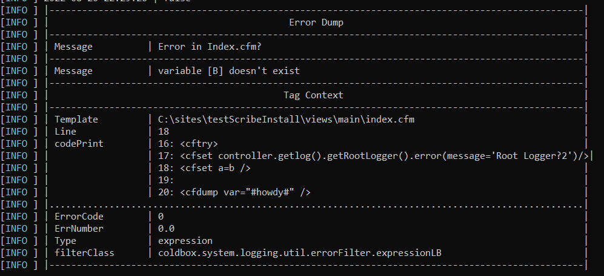

# ScribeConsole

This outputs the error to the console but is formatted to be easier to read. An example is below.&#x20;

The output will auto size based on the content in the error itself. This format is made further readable by running the log through the ErrorFilter ( use cleanErrors : true in the configuration ) but it is not necessary.&#x20;
